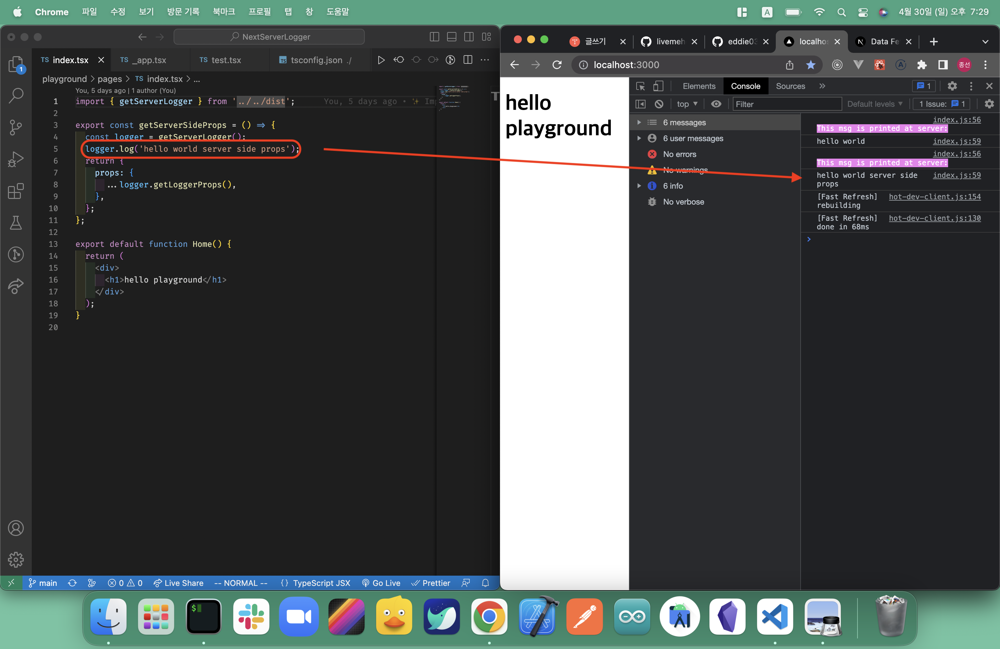

<p align="center">
  
</p>

<p align="center">
  <a href="https://npmjs.com/package/next-server-logger"></a>
  <a href="https://github.com/eddie0329/next-server-logger/pulls"></a>
  <a href="https://github.com/eddie0329/next-server-logger/tree/main/playground"></a>
  <a href="http://npm-stat.com/charts.html?package=next-server-logger&from=2023-04-07"></a>
</p>
<br />


## 🤔 What is next-server-logger?
<p align="center">
  
</p>

Have you ever had experience debugging code in `getServerSideProps, getStaticProps, or getInitailProps?` <br />
It's hard to debug when application is deployed and need some extra steps to see actual logged. <br />
Now use NextServerLogger and see logs in browser. 🎉

NextServerLogger is `next.js helper tool` that enable passing server logs, which are defined inside getServerSideProps, getStaticProps, or getInitialProps, to browser.

## 🛠 Installation

```shell
yarn add next-server-logger
npm install next-server-logger
```

```javascript
// _app.js
import { NextServerLoggerProvider } from 'next-server-logger'

export default function App({ Component, pageProps }) {
	return (
		<>
			<NextServerLoggerProvider pageProps={pageProps} enable={process.env.NEXT_PUBLIC_ENV === 'development'} />
			<Component {...pageProps} />
		</>
	);
}
```

## 🌈 Usage

### 1. App.getInitialProps

```javascript
import { getServerLogger } from 'next-server-logger'

App.getInitialProps = async ({ Component, ctx }) => {
	let pageProps = {};
	if (Component.getInitialProps) {
		pageProps = await Component.getInitialProps(ctx);
	}
	const logger = getServerLogger();
	logger.log('hello world'); // logging

	return {
		pageProps: { 
      ...pageProps, 
      ...logger.getAppLoggerProps() // ⭐️ need to pass logger props
    }, 
	};
};
```

### 2. getServerSideProps

```javascript
import { getServerLogger } from 'next-server-logger'

export const getServerSideProps = () => {
	const logger = getServerLogger();
	logger.log('hello world server side props'); // logging
	return {
		props: {
			...logger.getLoggerProps(), // ⭐️ need to pass logger props
		},
	};
};
```

### 3. getStaticProps

```javascript
import { getServerLogger } from 'next-server-logger'

export const getStaticProps = () => {
	const logger = getServerLogger();
	logger.log('hello world static props'); // logging
	return {
		props: {
			...logger.getLoggerProps(), // ⭐️ need to pass logger props
		},
	};
};
```

## 🚧 Interface

### NextServerLoggerProvider

```typescript
type NextServerLoggerProvider = React.FC<{ pageProps: any, enable?: boolean | true }>
```

NextServerLoggerProvider has two props, pageProps and enable.
`pageProps` is next page props.
`enable` can handle logging enabled or not.

### logger.log

```typescript
type logger.log = (...params: any[]) => void
```

Logger.log -> pass any params you want to log just like console.log
